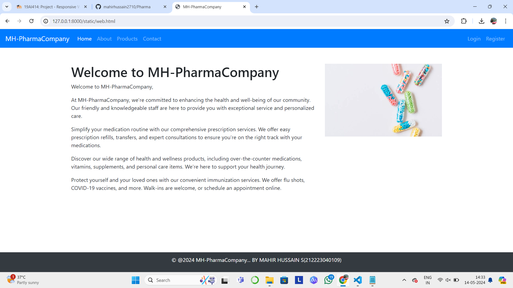
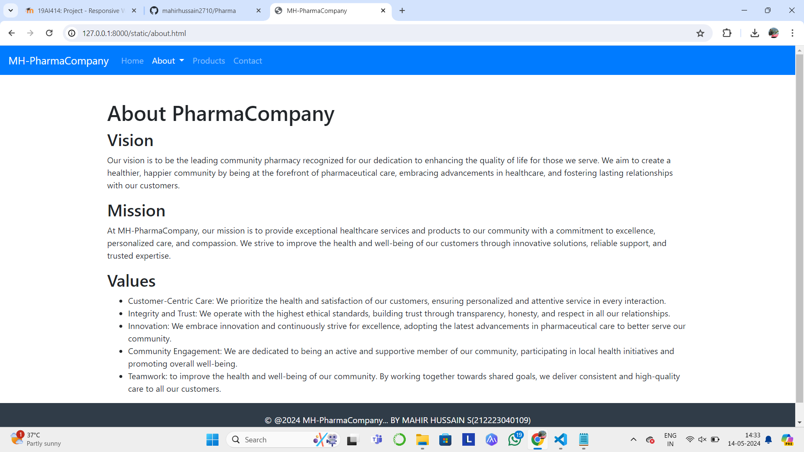
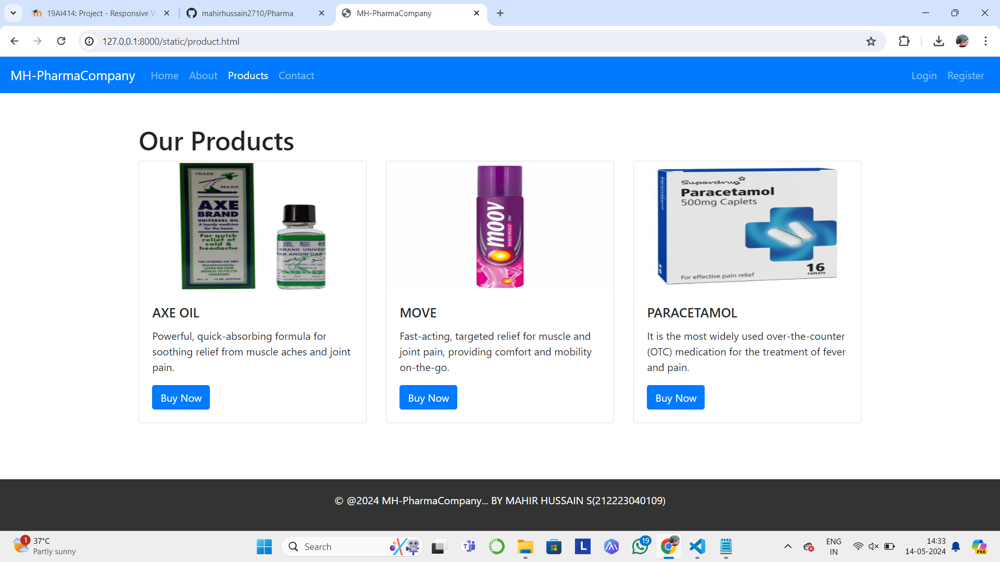
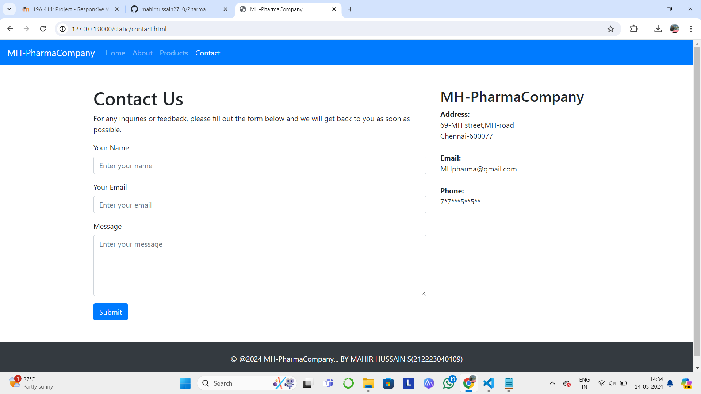

# Project Responsive Web Design using Bootstrap
## Date:14-05-2024

## AIM:
To design a responsive website for a Pharmaceutical Company using Bootstrap.


## DESIGN STEPS:

### Step 1:
Clone the repository from GitHub.

### Step 2:
Create Django Admin project.

### Step 3:
Create a New App under the Django Admin project.

### Step 4:
Insert the necessary CSS and JavaScript files as external in order to use Bootstrap.

### Step 5:
Create a HTML file and include the needed Bootstrap components.

### Step 6:
Publish the website in the LocalHost.

## PROGRAM :
```
home.html

<!DOCTYPE html>
<html lang="en">
<head>
  <meta charset="UTF-8">
  <meta name="viewport" content="width=device-width, initial-scale=1.0">
  <title>MH-PharmaCompany</title>
  <!-- Bootstrap CSS -->
  <link href="https://stackpath.bootstrapcdn.com/bootstrap/4.5.2/css/bootstrap.min.css" rel="stylesheet">
  <style>
    .navbar {
      background-color: #c82222; 
    }
    footer {
      position: fixed;
      bottom: 0;
      width: 100%;
      background-color: yellow; 
      color: rgb(190, 95, 95); 
      padding: 10px 0;
    }
  </style>
</head>
<body>

  <!-- Navbar -->
  <nav class="navbar navbar-expand-lg navbar-dark bg-primary">
    <a class="navbar-brand" href="#">MH-PharmaCompany</a>
    <button class="navbar-toggler" type="button" data-toggle="collapse" data-target="#navbarSupportedContent" aria-controls="navbarSupportedContent" aria-expanded="false" aria-label="Toggle navigation">
      <span class="navbar-toggler-icon"></span>
    </button>

    <div class="collapse navbar-collapse" id="navbarSupportedContent">
      <ul class="navbar-nav mr-auto">
        <li class="nav-item active">
          <a class="nav-link" href="home.html">Home <span class="sr-only">(current)</span></a>
        </li>
        <li class="nav-item">
          <a class="nav-link" href="about.html">About</a>
        </li>
        <li class="nav-item">
          <a class="nav-link" href="product.html">Products</a>
        </li>
        <li class="nav-item">
          <a class="nav-link" href="contact.html">Contact</a>
        </li>
      </ul>
      <ul class="navbar-nav ml-auto">
        <li class="nav-item">
          <a class="nav-link" href="#">Login</a>
        </li>
        <li class="nav-item">
          <a class="nav-link" href="#">Register</a>
        </li>
      </ul>
    </div>
  </nav>

  <!-- Page Content -->
  <div class="container mt-5">
    <div class="row">
      <div class="col-md-8">
        <h1>Welcome to MH-PharmaCompany</h1>
        <p>Welcome to MH-PharmaCompany,</p>
        <p>At MH-PharmaCompany, we're committed to enhancing the health and well-being of our community. Our friendly and knowledgeable staff are here to provide you with exceptional service and personalized care.</p>
        <p>Simplify your medication routine with our comprehensive prescription services. We offer easy prescription refills, transfers, and expert consultations to ensure you’re on the right track with your medications.</p>
        <p>Discover our wide range of health and wellness products, including over-the-counter medications, vitamins, supplements, and personal care items. We're here to support your health journey.</p>
        <p>Protect yourself and your loved ones with our convenient immunization services. We offer flu shots, COVID-19 vaccines, and more. Walk-ins are welcome, or schedule an appointment online.</p>
      </div>
      <div class="col-md-4">
        
      </div>
    </div>
  </div>

  <!-- Footer -->
  <footer class="bg-dark text-white text-center">
    <div class="container">
      <p>&copy; @2024 MH-PharmaCompany... BY MAHIR HUSSAIN S(212223040109)</p>
    </div>
  </footer>

  <!-- Bootstrap JS -->
  <script src="https://code.jquery.com/jquery-3.5.1.slim.min.js"></script>
  <script src="https://cdn.jsdelivr.net/npm/popper.js@1.16.1/dist/umd/popper.min.js"></script>
  <script src="https://stackpath.bootstrapcdn.com/bootstrap/4.5.2/js/bootstrap.min.js"></script>
</body>
</html>

about.html

<!DOCTYPE html>
<html lang="en">
<head>
  <meta charset="UTF-8">
  <meta name="viewport" content="width=device-width, initial-scale=1.0">
  <title>MH-PharmaCompany</title>
  <!-- Bootstrap CSS -->
  <link href="https://stackpath.bootstrapcdn.com/bootstrap/4.5.2/css/bootstrap.min.css" rel="stylesheet">
  <style>
    body {
      display: flex;
      flex-direction: column;
      min-height: 100vh;
    }
    .content {
      flex: 1;
    }
    footer {
      background-color: #303c48; /* Dark background color */
      color: white; /* Text color */
      text-align: center;
      padding: 20px 0;
      width: 100%;
    }
  </style>
</head>
<body>

  <!-- Navbar -->
  <nav class="navbar navbar-expand-lg navbar-dark bg-primary">
    <a class="navbar-brand" href="#">MH-PharmaCompany</a>
    <button class="navbar-toggler" type="button" data-toggle="collapse" data-target="#navbarSupportedContent" aria-controls="navbarSupportedContent" aria-expanded="false" aria-label="Toggle navigation">
      <span class="navbar-toggler-icon"></span>
    </button>

    <div class="collapse navbar-collapse" id="navbarSupportedContent">
      <ul class="navbar-nav mr-auto">
        <li class="nav-item">
          <a class="nav-link" href="web.html">Home</a>
        </li>
        <li class="nav-item dropdown active">
          <a class="nav-link dropdown-toggle" href="about.html" id="navbarDropdownAbout" role="button" data-toggle="dropdown" aria-haspopup="true" aria-expanded="false">
            About
          </a>
          <div class="dropdown-menu" aria-labelledby="navbarDropdownAbout">
            <a class="dropdown-item" href="#vision">Vision</a>
            <a class="dropdown-item" href="#mission">Mission</a>
            <a class="dropdown-item" href="#values">Values</a>
            <!-- Add more subheadings as needed -->
          </div>
        </li>
        <li class="nav-item">
          <a class="nav-link" href="product.html">Products</a>
        </li>
        <li class="nav-item">
          <a class="nav-link" href="#">Contact</a>
        </li>
      </ul>
    </div>
  </nav>

  <!-- Page Content -->
  <div class="container mt-5 content">
    <div class="row">
      <div class="col-md-12">
        <h1>About PharmaCompany</h1>
        <div id="vision">
          <h2>Vision</h2>
          <p>Our vision is to be the leading community pharmacy recognized for our dedication to enhancing the quality of life for those we serve. We aim to create a healthier, happier community by being at the forefront of pharmaceutical care, embracing advancements in healthcare, and fostering lasting relationships with our customers.</p>
        </div>
        <div id="mission">
          <h2>Mission</h2>
          <p>At MH-PharmaCompany, our mission is to provide exceptional healthcare services and products to our community with a commitment to excellence, personalized care, and compassion. We strive to improve the health and well-being of our customers through innovative solutions, reliable support, and trusted expertise.</p>
        </div>
        <div id="values">
          <h2>Values</h2>
          <ul>
            <li>Customer-Centric Care: We prioritize the health and satisfaction of our customers, ensuring personalized and attentive service in every interaction.</li>
            <li>Integrity and Trust: We operate with the highest ethical standards, building trust through transparency, honesty, and respect in all our relationships.</li>
            <li>Innovation: We embrace innovation and continuously strive for excellence, adopting the latest advancements in pharmaceutical care to better serve our community.</li>
            <li>Community Engagement: We are dedicated to being an active and supportive member of our community, participating in local health initiatives and promoting overall well-being.</li>
            <li>Teamwork: to improve the health and well-being of our community. By working together towards shared goals, we deliver consistent and high-quality care to all our customers.</li>
          </ul>
        </div>
        <!-- Add more subheadings as needed -->
      </div>
    </div>
  </div>

  <!-- Footer -->
  <footer>
    <div class="container">
        <p>&copy; @2024 MH-PharmaCompany... BY MAHIR HUSSAIN S(212223040109)</p>
    </div>
  </footer>

  <!-- Bootstrap JS -->
  <script src="https://code.jquery.com/jquery-3.5.1.slim.min.js"></script>
  <script src="https://cdn.jsdelivr.net/npm/popper.js@1.16.1/dist/umd/popper.min.js"></script>
  <script src="https://stackpath.bootstrapcdn.com/bootstrap/4.5.2/js/bootstrap.min.js"></script>
</body>
</html>

product.html

<!DOCTYPE html>
<html lang="en">
<head>
  <meta charset="UTF-8">
  <meta name="viewport" content="width=device-width, initial-scale=1.0">
  <title>MH-PharmaCompany</title>
  <!-- Bootstrap CSS -->
  <link href="https://stackpath.bootstrapcdn.com/bootstrap/4.5.2/css/bootstrap.min.css" rel="stylesheet">
  <style>
    body {
      display: flex;
      flex-direction: column;
      min-height: 100vh;
      margin: 0;
      padding: 0;
      background: url('download.jpeg') no-repeat center center fixed;
      background-size: cover;
    }
    .content {
      flex: 1;
    }
    footer {
      background-color: rgba(0, 0, 0, 0.8); /* Dark background color with opacity */
      color: white; /* Text color */
      text-align: center;
      padding: 20px 0;
      width: 100%;
    }
  </style>
</head>
<body>

  <!-- Navbar -->
  <nav class="navbar navbar-expand-lg navbar-dark bg-primary">
    <a class="navbar-brand" href="#">MH-PharmaCompany</a>
    <button class="navbar-toggler" type="button" data-toggle="collapse" data-target="#navbarSupportedContent" aria-controls="navbarSupportedContent" aria-expanded="false" aria-label="Toggle navigation">
      <span class="navbar-toggler-icon"></span>
    </button>

    <div class="collapse navbar-collapse" id="navbarSupportedContent">
      <ul class="navbar-nav mr-auto">
        <li class="nav-item">
          <a class="nav-link" href="web.html">Home</a>
        </li>
        <li class="nav-item">
          <a class="nav-link" href="about.html">About</a>
        </li>
        <li class="nav-item active">
          <a class="nav-link" href="product.html">Products <span class="sr-only">(current)</span></a>
        </li>
        <li class="nav-item">
          <a class="nav-link" href="contact.html">Contact</a>
        </li>
      </ul>
      <ul class="navbar-nav ml-auto">
        <li class="nav-item">
          <a class="nav-link" href="#">Login</a>
        </li>
        <li class="nav-item">
          <a class="nav-link" href="#">Register</a>
        </li>
      </ul>
    </div>
  </nav>

  <!-- Page Content -->
  <div class="container mt-5 content">
    <div class="row">
      <div class="col-md-12">
        <h1>Our Products</h1>
        <div class="card-deck">
          <div class="card">
            
            <div class="card-body">
              <h5 class="card-title">AXE OIL</h5>
              <p class="card-text">Powerful, quick-absorbing formula for soothing relief from muscle aches and joint pain.</p>
              <a href="#" class="btn btn-primary">Buy Now</a>
            </div>
          </div>
          <div class="card">
            
            <div class="card-body">
              <h5 class="card-title">MOVE</h5>
              <p class="card-text"> Fast-acting, targeted relief for muscle and joint pain, providing comfort and mobility on-the-go.</p>
              <a href="#" class="btn btn-primary">Buy Now</a>
            </div>
          </div>
          <div class="card">
            
            <div class="card-body">
              <h5 class="card-title">PARACETAMOL</h5>
              <p class="card-text">It is the most widely used over-the-counter (OTC) medication for the treatment of fever and pain.</p>
              <a href="#" class="btn btn-primary">Buy Now</a>
            </div>
          </div>
        </div>
      </div>
    </div>
  </div>

  <!-- Footer -->
  <footer>
    <div class="container">
        <p>&copy; @2024 MH-PharmaCompany... BY MAHIR HUSSAIN S(212223040109)</p>
    </div>
  </footer>

  <!-- Bootstrap JS -->
  <script src="https://code.jquery.com/jquery-3.5.1.slim.min.js"></script>
  <script src="https://cdn.jsdelivr.net/npm/popper.js@1.16.1/dist/umd/popper.min.js"></script>
  <script src="https://stackpath.bootstrapcdn.com/bootstrap/4.5.2/js/bootstrap.min.js"></script>
</body>
</html>

contact.html

<!DOCTYPE html>
<html lang="en">
<head>
  <meta charset="UTF-8">
  <meta name="viewport" content="width=device-width, initial-scale=1.0">
  <title>MH-PharmaCompany</title>
  <!-- Bootstrap CSS -->
  <link href="https://stackpath.bootstrapcdn.com/bootstrap/4.5.2/css/bootstrap.min.css" rel="stylesheet">
</head>
<body>

  <!-- Navbar -->
  <nav class="navbar navbar-expand-lg navbar-dark bg-primary">
    <a class="navbar-brand" href="#">MH-PharmaCompany</a>
    <button class="navbar-toggler" type="button" data-toggle="collapse" data-target="#navbarSupportedContent" aria-controls="navbarSupportedContent" aria-expanded="false" aria-label="Toggle navigation">
      <span class="navbar-toggler-icon"></span>
    </button>

    <div class="collapse navbar-collapse" id="navbarSupportedContent">
      <ul class="navbar-nav mr-auto">
        <li class="nav-item">
          <a class="nav-link" href="web.html">Home</a>
        </li>
        <li class="nav-item">
          <a class="nav-link" href="about.html">About</a>
        </li>
        <li class="nav-item">
          <a class="nav-link" href="product.html">Products</a>
        </li>
        <li class="nav-item active">
          <a class="nav-link" href="contact.html">Contact <span class="sr-only">(current)</span></a>
        </li>
      </ul>
    </div>
  </nav>

  <!-- Page Content -->
  <div class="container mt-5">
    <div class="row">
      <div class="col-md-8">
        <h1>Contact Us</h1>
        <p>For any inquiries or feedback, please fill out the form below and we will get back to you as soon as possible.</p>
        <form>
          <div class="form-group">
            <label for="name">Your Name</label>
            <input type="text" class="form-control" id="name" placeholder="Enter your name">
          </div>
          <div class="form-group">
            <label for="email">Your Email</label>
            <input type="email" class="form-control" id="email" placeholder="Enter your email">
          </div>
          <div class="form-group">
            <label for="message">Message</label>
            <textarea class="form-control" id="message" rows="5" placeholder="Enter your message"></textarea>
          </div>
          <button type="submit" class="btn btn-primary">Submit</button>
        </form>
      </div>
      <div class="col-md-4">
        <h2>MH-PharmaCompany</h2>
        <address>
          <strong>Address:</strong><br>
          69-MH street,MH-road<br>
          Chennai-600077<br><br>
          <strong>Email:</strong><br>
          MHpharma@gmail.com<br><br>
          <strong>Phone:</strong><br>
          7*7***5**5**
        </address>
      </div>
    </div>
  </div>
  <body background="a.png" style="background-repeat: no-repeat; background-size: cover;">


  <!-- Footer -->
  <footer class="bg-dark text-white text-center py-4 mt-5">
    <p>&copy; @2024 MH-PharmaCompany... BY MAHIR HUSSAIN S(212223040109)</p>
  </footer>

  <!-- Bootstrap JS -->
  <script src="https://code.jquery.com/jquery-3.5.1.slim.min.js"></script>
  <script src="https://cdn.jsdelivr.net/npm/popper.js@1.16.1/dist/umd/popper.min.js"></script>
  <script src="https://stackpath.bootstrapcdn.com/bootstrap/4.5.2/js/bootstrap.min.js"></script>
</body>
</html>
```
## OUTPUT:




## RESULT:
The Project for responsive web design using Bootstrap is completed successfully.
